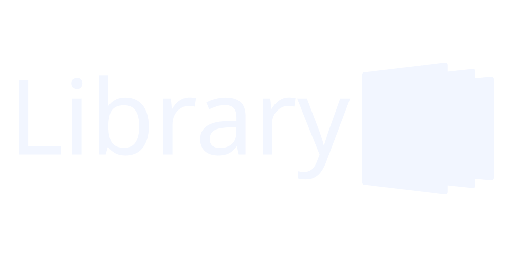

## A Clean, Modern, Bigscreen Interface for Pegasus Frontend

If you are looking to use this theme, [Check out the website for this theme here.](https://fr75s.github.io/library/assets/SAFELY_REMOVABLE/website/main.html)

Library is a clean, modern interface for [Pegasus Frontend](http://pegasus-frontend.org) that aims to provide a theme which doesn't emphasize text. Inspired partly by the Steam Deck's UI, this interface focuses more on providing the box art in organized categories, with little textual metadata.

***

## Installation

[Full installation instructions are available here.](https://fr75s.github.io/library/assets/SAFELY_REMOVABLE/website/install.html)

To install this theme, first download this repository (either through `git clone https://github.com/Fr75s/library.git` or through downloading this zip), then move (and extract if you downloaded the zip) to [your themes folder.](https://pegasus-frontend.org/docs/user-guide/installing-themes/) Finally, remove the SAFELY_REMOVABLE folder located within this theme's folder under assets.

***

## Special Thanks

I used other themes as references while building Library. These themes are listed below.

- https://github.com/valsou/neoretro: The framework I built this theme off of, used for the separate page file system and Colcon.qml.
- https://github.com/TigraTT-Driver/shinretro: A theme which provided the functionality for portrait-style steam game box art and more. I didn't find out about this theme until Library was mostly complete.
- https://github.com/PlayingKarrde/clearOS: A theme providing part of the search functionality of the theme.

***

## Issues?

If you find any issues or want to let me know of anything, feel free to open up an issue in this project. You may also want to check out the [Modifications Guide](https://github.com/Fr75s/library/blob/main/MODIFICATIONS.md) and see if I have placed a fix there. If not, then, once again, feel free to open up an issue, and I will fix it.

If you know a language other than English, I encourage you to translate this theme. All relevant info is in the [Translation Section](https://github.com/Fr75s/library/blob/main/MODIFICATIONS.md) of the modifications guide and in Localization.qml.
