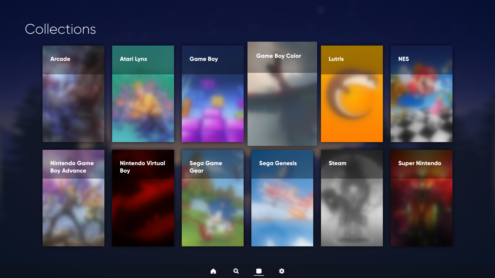

## A Clean, Modern, Bigscreen Interface for Pegasus Frontend

Library is a clean, modern interface for [Pegasus Frontend](http://pegasus-frontend.org) that aims to provide a theme which doesn't emphasize text. Inspired partly by the Steam Deck's UI, this interface focuses more on providing the box art in organized categories, with little textual metadata.

Library aims to be easy to use (at least once Pegasus Frontend has been fully set up, [but there are tools for that](https://github.com/muldjord/skyscraper)), but allow for customization. You will find yourself at home with this theme and its comfortable interface.

***

## Features

### Customizable

Library has several toggleable options which allow you to easily modify parts of the theme. Options include a light mode, expanding the game width and more. Of course, you can always customize the QML files with help [from our guide](MODIFICATIONS.md).

### Little Hassle

Library is a theme that is quite simple to use, making it easy to search through your game library. It also uses little metadata: only the title, box art and another art/screenshot is needed for games to show like normal.

### Advanced Features

Library has several advanced features which other themes don't have, such as mouse-based navigation and a virtual keyboard for searching. These advanced features help to improve your experience.

***

## Other Things to Note

Library is still in beta, and changes are made often. The theme in its current state, however, is perfectly usable.

Library was made as a personal project for my needs, created so that I could have a decent interface for the Pegasus frontend. For the more advanced techniques used in this theme, I referred to other Pegasus themes and QML documentation (requiring lots of searching). A list of these themes are below.

## Special Thanks

- https://github.com/valsou/neoretro: The framework I built this theme off of, used for the separate page file system and Colcon.qml.
- https://github.com/TigraTT-Driver/shinretro: A theme which provided the functionality for portrait-style steam game box art and more. I didn't find out about this theme until Library was mostly complete.
- https://github.com/PlayingKarrde/clearOS: A theme providing part of the search functionality of the theme.

***

## Gallery

Home Page

 Favorites

 Collections

 All Games

 Searching

 Inside A Collection

 Settings

 Light Mode + Top Bar

 Plain Background + Wide Games + Button Prompts

***

## Installation

Installing this theme is simple:

First, download this theme's contents. The most easy way to do this is by clicking the Code button at the top of the page and downloading the code as a ZIP file.

Next, extract the contents of the .zip file to your themes folder: [refer to here for more information.](https://pegasus-frontend.org/docs/user-guide/installing-themes/)

Finally, you may remove the SAFELY_REMOVABLE folder that's in the assets folder, as it only provides screenshots and other useless resources that may take up space.
